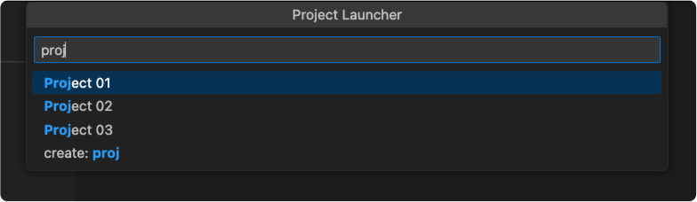

# project-launcher

A VSCode extension to launch, search, and create projects.

## Usage
Open the project launcher via the command menu, look for 'Project Launcher', select that and you will see your projects after you have set the base path.

## Preview

## Extension Settings

* `project-launcher.basePath`: Base path of where the project launcher looks to search & create projects. 

## Issues

Create an issue for bugs and feature requests.

